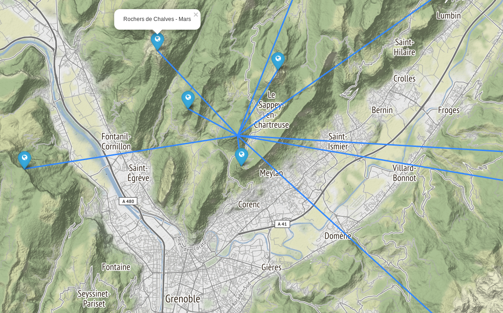

# Une planète au sommet

Recherche systématique des ensembles de sommets pouvant former entre-eux un système solaire à l'échelle.

Un exemple depuis l'Ecoutoux:

Le notebook complet est ici [uneplaneteausommet.ipynb](./uneplaneteausommet.ipynb).

Les sommets non visibles depuis le centre sont éliminés de la recherche. Le notebook [is_visible.ipynb](./is_visible.ipynb) explique le calcul (avec les données topologiques). Par simplicité, la fonction utilisée est ensuite copiée dans le module `is_visible.py`.

Le notebook [map_plot.ipynb](./map_plot.ipynb) permet de tester cette fonction. 

## install & run

    virtualenv -p /usr/bin/python3 py3
    source ./py3/bin/activate
    
    pip install jupyter
    pip install numpy matplotlib

    pip install folium

    jupyter notebook
    
    
