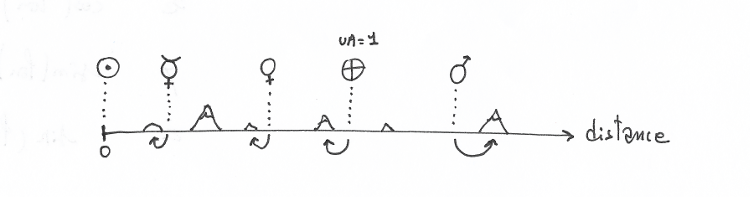
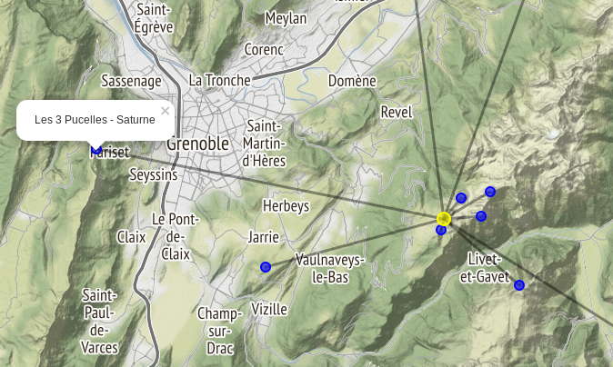

# Une planète au sommet

Recherche systématique des ensembles de sommets pouvant former entre-eux un système solaire à l'échelle.

Un exemple plutôt bien depuis l'Écoutoux (Chartreuse):

Soleil : L'Écoutoux   diamètre: 4217 cm 

       Planète  Sommet                                   Erreur(%)   Distance(km)  Diamètre
    -----------------------------------------------------------------------------------------
       Mercure: Saint-Eynard (1359m)                        2.94       1.81         14.8 cm
         Vénus: Aiguille de Quaix (1143m)                   1.02       3.31         36.7 cm
         Terre: Chamechaude (2082m)                         0.00       4.53         38.6 cm
          Mars: Rochers de Chalves (1845m)                  0.33       6.89         20.5 cm
         Cérès: La Sure (1643m)                             1.34      12.71          3.0 cm
       Jupiter: Pic de l'apparence (2714m)                  0.03      23.58        423.7 cm
       Saturne: Sommet de Pierre Blanche (2108m)            2.41      44.29        353.0 cm
        Uranus: Aiguille du Grand Fond (2920m)              2.63      84.75        153.7 cm
       Neptune: Grandes Jorasses/ Pointe Walker (4208m)    14.63     117.75        149.2 cm
        Pluton: Grandes Jorasses/ Pointe Walker (4208m)    41.28     117.75          7.2 cm
        
        
        
## Notebooks

Le notebook complet est ici [uneplaneteausommet.ipynb](./uneplaneteausommet.ipynb).

Les sommets non visibles depuis le centre sont éliminés de la recherche. Le notebook [is_visible.ipynb](./is_visible.ipynb) explique le calcul (avec les données topologiques). Par simplicité, la fonction utilisée est ensuite copiée dans le module `is_visible.py`.

Le notebook [map_plot.ipynb](./map_plot.ipynb) permet de tester cette fonction. 

## install & run

    virtualenv -p /usr/bin/python3 py3
    source ./py3/bin/activate
    
    pip install jupyter
    pip install numpy matplotlib

    pip install folium

    jupyter notebook
    
    
    
## Résultats

### Top 10 des soleils
calculé sur les 40 sommets le plus proche de Grenoble. 

                Croix de Chamrousse: 2.19    erreur cumulée=   40.9%
                       Saint-Eynard: 3.96    erreur cumulée=   42.1%
                  Rochers de l'Ours: 2.63    erreur cumulée=   62.3%
                         L'Écoutoux: 4.28    erreur cumulée=   64.3%
                 Rochers de Chalves: 3.36    erreur cumulée=   66.9%
                           La Buffe: 3.24    erreur cumulée=   76.3%
                       Grand Eulier: 3.02    erreur cumulée=   79.7%
                   Pic Saint-Michel: 4.26    erreur cumulée=   84.6%
                           La Pinéa: 3.91    erreur cumulée=   90.5%
                      Roc Cornafion: 4.00    erreur cumulée=   97.1%
                      
                      

## depuis la Croix de Chamrousse :

    Soleil : Croix de Chamrousse   diamètre: 2041 cm 

       Planète  Sommet                                   Erreur(%)   Distance(km)  Diamètre
    -----------------------------------------------------------------------------------------
       Mercure: Rocher de la Perche (2152m)                25.78       0.66          7.2 cm
         Vénus: Grand Eulier (2232m)                        1.53       1.61         17.8 cm
         Terre: Petit Van (2439m)                           0.00       2.19         18.7 cm
          Mars: Pointe de Jasse Bralard (2491m)             4.83       3.19          9.9 cm
         Cérès: Grand Galbert (2561m)                       1.97       5.95          1.4 cm
       Jupiter: Bellevue (733m)                             3.96      10.97        205.1 cm
       Saturne: Les 3 Pucelles (1456m)                      0.42      21.02        170.8 cm
        Uranus: Dôme de Neige des Écrins (4015m)            0.43      41.93         74.4 cm
       Neptune: Le Trélod (2181m)                           1.63      67.07         72.2 cm
        Pluton: Grand Colombier (1534m)                     0.33      86.92          3.5 cm

