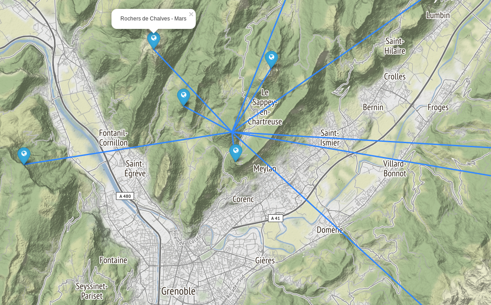

# Une Planète Au Sommet

Recherche systématique des ensembles de sommets pouvant former entre-eux un système solaire à l'échelle.

un example :

Le notebook est [uneplaneteausommet.ipynb](./uneplaneteausommet.ipynb).

## install & run

    virtualenv -p /usr/bin/python3 py3
    source ./py3/bin/activate
    
    pip install jupyter
    pip install numpy matplotlib

    pip install folium

    jupyter notebook
    
    
## 
